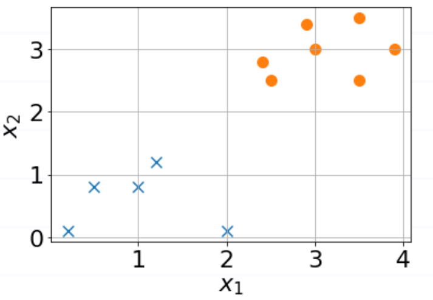

# Evaluation Metrics

1. (MLB) Two probability mass functions are given as

$p(x)=[0.1,0.1,0.8]$ for $x=0,1,2$

$q(x)=[0.8,0.1,0.1]$ for $x=0,1,2$.
Find the KL-divergence $K L[p \| q]$ rounded off to the nearest integer. (Hint: $K L[p \| q]=-\sum_{x} p(x) \log \left(\frac{q(x)}{p(x)}\right)$ )
  - 0
  - -1
  - 1
  - -2
  - 2

2. (MLB) The model that classifies the two classes x and o is:

  - $ y=\sigma\left(x_{1}+x_{2}+3\right)$

  - $ y=\sigma\left(x_{1}-x_{2}+3\right)$

  - $ y=\sigma\left(x_{1}+x_{2}-3\right)$

  - $ y=\sigma\left(x_{1}-x_{2}-3\right)$

3. (MLB) The confusion matrix for a detection model for red roses is shown below. 

|  	| Estimated True 	| Estimated False 	|
|---	|---	|---	|
| Ground True 	| 20 	| 5 	|
| Ground False 	| 15 	| 30 	|

The precision of the model is

  - 2/3
  - 6/7
  - 4/5
  - 1/6
  - None of these

4. (MLB) This task needs high precision, even if recall may be compromised, during automation. Mark True or False.
  - legal punishment of life imprisonment
  - scanning at an airport security check
  - gold search on the sandy surface of a beach
  - COVID test to recommend quarantine
  - tumour detection for leg amputation
  - credit card fraud detection

5. (MLB) Which of the following tasks need high precision while recall could be somewhat compromised?
- Death sentence to a robber
- Giving access to top-secret defense information
- Screening of job applicants
- Hanuman is asked to bring herbs to save Laxman

6. (MLB) You designed an ML model to detect covid. The model gave the following outputs on test data: P(covid=True) = [.9,.9,.8,.8,.6,.4, .8,.5,.4,.3,.3,.2], when the actual labels were True for the first half and False for the second half, respectively. What threshold for detection will achieve the best accuracy? 
- 0.55
- 0.85
- 0.45
- 0.65
- 0.75

7. (MLB) You designed an ML model to detect covid. The model gave the following outputs on test data: P(covid=True) = [.9,.9,.8,.8,.6,.4, .8,.5,.4,.3,.3,.2], when the actual labels were True for the first half and False for the second half, respectively. At a threshold of 0.75, the F1 score of the model lies between:
- 0.70 - 0.75
- 0.75 - 0.80
- 0.80 - 0.85
- 0.65 - 0.70
- 0.60 - 0.65 

8. (MLB) For a detection model, with threshold $\theta\in(0,1)$, the precision of the model is found to be $e^{\theta-1}$ and recall is $e^{-5\theta}$. What is the value of $\theta$ for which the F-measure is maximum?

9. (MLB) Subal's mom gave him the following list of items to bring from the market: wheat-flour, rice, rajma, moongdal, jeera, salt, turmeric, ghee, oil. Subal lost the list on his way to the market and purchased following items: rice, rajma, potato-chips, laddoos, salt, ghee, oil, saunf. The F-measure of Subal is _____.
