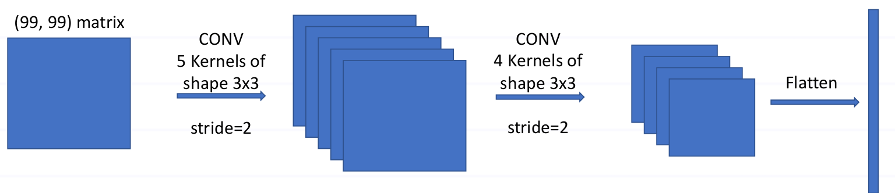

# Convolutional Neural Networks

1. (CNN) A 33×33 RGB image is passed through a CNN with two layers. The first convolution layer has 10 filters of size 3×5 and stride 2. The second layer is a dense layer with 5 neurons and operates on the flattened output of the first layer.
   - The output size of first layer will be ______
   - The number of computations in forward pass will be ______
   - The number of trainable parameters (weights and biases) in the model is ______
  
   Hint: an RGB image has 3 channels.

2. (CNN) Mark the correct statement(s). For processing a time series, 
    - CNN is analogous to a finite impulse response filter
    - RNN is analogous to an infinite impulse response filter
    - CNN is analogous to an LTI (linear time-invariant) filter
    - RNN is analogous to an LTI (linear time-invariant) filter
    - Neither CNN nor RNN could be used as a filter; they could be classifiers

3. (CNN) A Convolutional Neural network has 5 filters of size 3x3 and sigmoid non-linearity. For an input $x[i,j,k]$; $i$=0,1,...19; $j$=0,1,...19, $k$=0,1,2. Write the equations for 
   - Estimating the output $\hat{y}$
   - Iteratively updating each trainable parameter while minimizing squared error loss w.r.t. ground truth $y$

4. (CNN) The input to a convolutional layer with an 11x11 filter with stride 1 is an image of size 15x15. In order to preserve the size of the input in the output, padding of size P along the border can be used. What is P?

5. (CNN) CNN's architecture is designed as given below
   
   - Find the total number of parameters (weights and biases) in the network
   - Find output size
   - Find the number of computations (multiplications) in the forward pass
